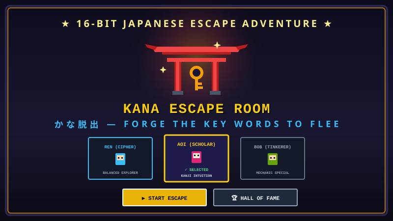
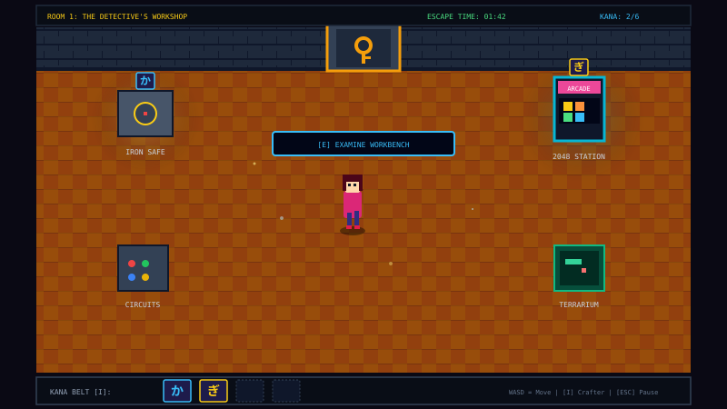
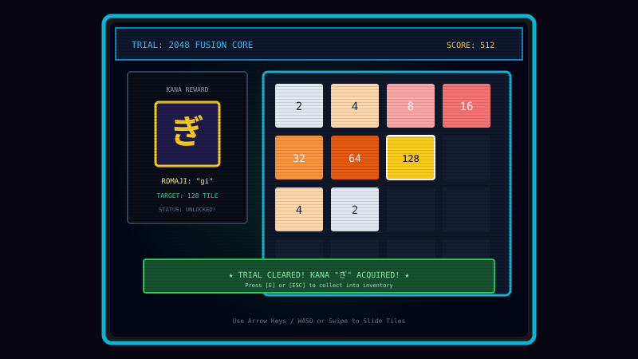
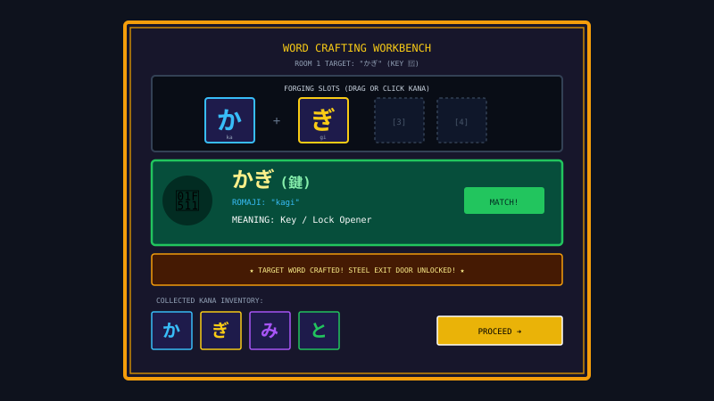
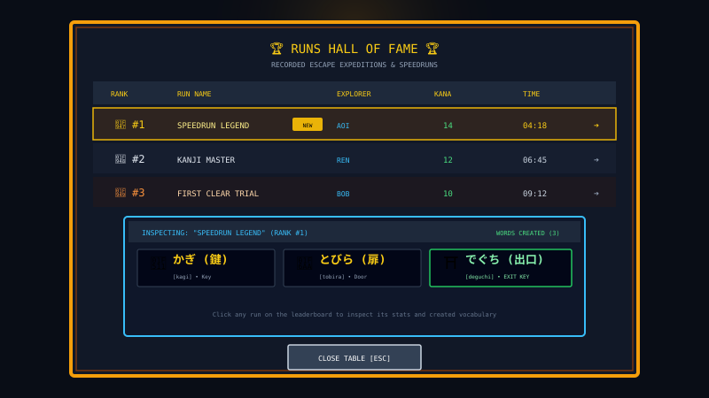

# ⛩️ Kana Escape Room (かな脱出)

> **An open-source retro pixel-art Japanese language learning escape room game created by VCHS Studios using AI.**

🌐 **Live Game**: [https://kana-escape-room.ai.studio/](https://kana-escape-room.ai.studio/)

[](https://kana-escape-room.ai.studio/)
[]
[]
[]
[]

---

## 🎮 Overview

**Kana Escape Room** is an interactive, story-driven retro 16-bit RPG escape room designed to teach Japanese Kana (Hiragana & Katakana) and practical vocabulary through engaging game mechanics.

Trapped inside mysterious chambers, you explore retro workshops, ancient archives, and sacred vault gateways. By solving unique arcade trials and puzzles, you discover Kana syllables, combine them at the word-crafting workbench to forge target Japanese key words (such as **かぎ** `[kagi]` *Key*, **とびら** `[tobira]` *Door*, and **でぐち** `[deguchi]` *Exit*), unlock exit gateways, and escape!

---

## ✨ Features

- **3 Handcrafted Escape Rooms**:
  - **Room 1: The Detective's Workshop** — Cluttered retro computing lab with electronic safes, neon arcades, and circuit switchboards (*Target: かぎ / Key*).
  - **Room 2: The Grand Archive** — Ancient stone library with sliding book racks, pendulum chronometers, and scholar logic tables (*Target: とびら / Door*).
  - **Room 3: The Secret Vault Gateway** — Sacred sanctuary marked by a stone Torii portal, reflex cores, and precision trials (*Target: でぐち / Exit*).

- **20+ Unique Arcade Minigames & Puzzles**:
  - *Reflex & Timing*: Timed Passcode Decryption, Pong Core Battle, Flappy Kana Glider, Lane Runner Obstacle Dodge.
  - *Classic Retro Arcades*: Snake, 2048, Wall Breaker (Breakout), Trajectory Catapult (Slingshot), Precision Darts.
  - *Logic & Strategy*: Sliding Tile Puzzle, Match-3 Gem Align, Tic-Tac-Toe Minimax, Dots & Boxes Grid, Sea Battle (Battleship), Rock-Paper-Scissors Duel, Memory Sequence Flashing, Card Flip Pair Matching, Mechanical Bolts Disassembly, Falling Kana Basket Catcher.

- **Interactive Word Crafter & Japanese Dictionary**:
  - Freely arrange Kana onto crafting slots to discover over 1,500+ recognized Japanese words.
  - Full dictionary metadata display: Hiragana/Katakana script, Kanji equivalents, Romaji pronunciation, English meanings, and icon representations.

- **8-Directional Pixel Character Movement**:
  - Authentic 8-way movement animations (including 3/4 isometric diagonal views: down-left, down-right, up-left, up-right).
  - Grounded walking cadence with weighted vertical step-bobbing.
  - Surface-acoustic footsteps (wood parquet, stone tile, tatami straw) and tactile collision wall bumping sound effects.

- **Subtle Atmospheric Pixel Ambience**:
  - Floating dust motes drifting across light beams.
  - Handcrafted flickering candle wall sconces and stone lanterns (*Tōrō*) with dynamic warm floor light halos.
  - Falling cherry blossom (*Sakura*) petals and floating spirit embers.

- **Generative 8-Bit Audio & Soundscapes**:
  - Built entirely using the Web Audio API with zero external audio assets required.
  - Generative ambient room soundscapes (computer server drones, ticking grandfather clocks, Japanese shrine wind bells).

- **Named Runs Hall of Fame Leaderboard**:
  - Name and record individual escape attempts.
  - Local rankings sorted by fastest escape time and Kana collected.
  - Run Inspector: Click any leaderboard entry to review its full summary, statistics, and every Japanese word created during that attempt.

---

## 📸 In-Game Screenshots (Gameplay Journey)

Here is a visual walk-through of the game experience across different points in time:

### 1. Title Screen & Explorer Selection
*Select your adventurer (Ren, Aoi, or Bob) and jump straight into the mystery, or inspect the local Hall of Fame.*

<p align="center">
  
</p>

---

### 2. Exploring Room 1 — The Detective's Workshop
*Navigate the 16-bit retro computing lab with authentic 8-directional movement, footstep sounds, ambient dust motes, and interactable consoles.*

<p align="center">
  
</p>

---

### 3. Solving Arcade Puzzles & Minigames
*Tackle 20+ diverse arcade stations (2048, Snake, Passcode Decryption, Pong, Trajectory Launcher, and more) to earn Kana syllables.*

<p align="center">
  
</p>

---

### 4. Word Crafting Workbench & Gateway Unlocking
*Combine collected Kana tiles on the forging slots. Crafting the room's secret Japanese target word unlocks the exit door to the next chamber.*

<p align="center">
  
</p>

---

### 5. Hall of Fame Leaderboard & Run Details Inspector
*Record your custom run name, compete for top speedrun rankings, and click any run to inspect its complete vocabulary log and stats.*

<p align="center">
  
</p>

---

## 🛠️ Tech Stack

- **Framework**: React 19 + TypeScript
- **Bundler & Dev Server**: Vite 8
- **Styling**: Tailwind CSS v4
- **Rendering**: HTML5 2D Canvas (Pixel-art rendering with nearest-neighbor crisp scaling)
- **Audio Engine**: Web Audio API (Synthesized procedural SFX & generative soundscapes)
- **Visual FX**: Canvas Confetti

---

## 🚀 Installation & Running Instructions

### Prerequisites

Make sure you have [Node.js](https://nodejs.org/) installed:
- **Node.js**: v18.0.0 or higher (v20+ recommended)
- **npm**: v9.0.0 or higher (comes with Node.js)

### 1. Clone the Repository

```bash
git clone https://github.com/17arigato-jwd/kana-escape-room.git
cd kana-escape-room
```

### 2. Install Dependencies

Install all required npm packages:

```bash
npm install
```

### 3. Run the Development Server

Start the local Vite dev server:

```bash
npm run dev
```

Open your browser and navigate to:
```
http://localhost:3000
```

### 4. Build for Production

To create an optimized production build:

```bash
npm run build
```

The compiled assets will be placed in the `dist/` directory.

### 5. Preview Production Build

To test the production build locally:

```bash
npm run preview
```

### 6. Lint & Type Check

To verify TypeScript types across the codebase:

```bash
npm run lint
```

---

## 🕹️ Controls & Keybindings

| Key / Action | Function |
| :--- | :--- |
| <kbd>W</kbd> <kbd>A</kbd> <kbd>S</kbd> <kbd>D</kbd> or <kbd>Arrow Keys</kbd> | Move character in 8 directions (supports diagonal movement) |
| <kbd>E</kbd> | Interact with stations, consoles, puzzles, and doors |
| <kbd>I</kbd> | Open Kana Inventory & Word Crafting Workbench |
| <kbd>ESC</kbd> | Pause Menu / Volume Controls / Close modals |

---

## 📁 Project Structure

```
kana-escape-room/
├── public/                 # Static assets & SVG media
│   ├── favicon.svg         # Pixel-art Torii & Key application icon
│   └── screenshots/        # High-fidelity in-game walkthrough screenshots
├── src/
│   ├── components/
│   │   ├── inventory/      # Word crafting workbench & inventory modal
│   │   ├── minigames/      # 20+ retro arcade & puzzle trial minigames
│   │   └── ui/             # Title screen, leaderboard, HUD, run details modal
│   ├── data/
│   │   ├── characters.ts   # Playable explorers & palettes
│   │   ├── dictionary.ts   # 1,500+ Japanese vocabulary dictionary
│   │   └── rooms.ts        # Room definitions, puzzle layouts & decor
│   ├── game/
│   │   ├── AtmosphericEffects.ts # Dust motes, sakura petals, candle flicker system
│   │   └── GameViewport.tsx      # Canvas game loop, movement & collision system
│   ├── types/
│   │   └── game.ts         # TypeScript definitions
│   ├── utils/
│   │   ├── audio.ts        # Procedural Web Audio API sound generator
│   │   ├── leaderboard.ts  # Run persistence & ranking algorithms
│   │   └── pixelArt.ts     # Procedural pixel-art sprites & tilesets
│   ├── App.tsx             # Main game state controller
│   └── main.tsx            # Application entry point
├── package.json
├── tsconfig.json
├── vite.config.ts
└── README.md
```

---

## 📜 Credits & License

- **Developer**: Created by **VCHS Studios** using AI.
- **License**: Released as an open-source project under the [MIT License](LICENSE).
- **Contributions**: Contributions, bug reports, and suggestions are welcome via GitHub pull requests and issues.
